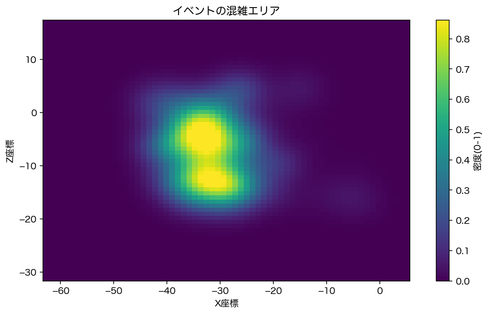

**非プログラマー向け VRChat 人流解析ツール**
— YAIBA-VRC のログから、グラフや動画を自動生成 —

---

## YAIBA-BI とは？

**YAIBA-BI は、VRChat の位置情報ログをアップロードするだけで
移動軌跡・滞在分布・ヒートマップ・可視化動画を自動生成できるツールです。**

元々 YAIBA はプログラマー向けの分析ツールでしたが、
YAIBA-BI によって **誰でも数クリックで人流解析ができる環境**を目指しています。

* VRChatイベントの動線可視化
* 展示会・バーイベントの混雑状況の分析
* 安全設計・導線改善のチェック
* 研究用途としての実験設計・行動分析

現実空間では難しい“人の動きの可視化”を、
**VR空間では誰もが手軽に実施できる世界**をつくるプロジェクトです。

---

## 📊 このツールでできること

> VRChat のログから自動生成される可視化例です。

### **① 同時接続数の推移（来場者数の変化が一目でわかる）**

イベント中に「何人が来ていたのか」「ピークはいつか」を時系列で確認できます。  
主催者がまず知りたい基礎的な指標を自動で可視化します。

  
   
  <em>同時接続数の推移（イベント中の来場人数を可視化）</em>

### **② ヒートマップ（どこが賑わっていたかを可視化）**

空間内の滞在傾向を色で表示します。  
混雑箇所・人気スポット・回遊性の把握が可能です。

  
   
  <em>ヒートマップ：参加者が長く滞在していた場所を色で可視化した図です。赤いほど滞在時間が長く、人気スポットや混雑箇所を把握できます。</em>

### **③ アニメーション可視化（空間内の動きをそのまま再生）**

参加者の動きを時間軸で再現したアニメーション動画を生成します。  
イベント紹介やデモ用途にも役立つ直感的な可視化です。

  <iframe 
    src="https://www.youtube.com/embed/-LIoVicXueo"
    style="position:absolute; top:0; left:0; width:100%; height:100%;"
    frameborder="0"
    allowfullscreen>
  </iframe>

---

## 🚀 使い方

**STEP 1 — YAIBA-VRC をワールドに設置**
ログ取得したいワールドに YAIBA-VRC を導入します。  
※ 詳しい導入手順は[YAIBA-VRCの導入手順](#yaiba-bi-manual)をご覧ください。

**STEP 2 — VRChat のログを取得**
`output_log_xxxxx.txt` を VRChat から取り出します。
>YAIBA-VRCを使用して取得した位置情報などのデータはVRChatのログデータに記録されています。ログデータの保存場所は、デフォルトの設定では  
>C:\\Users\\ (Windowsのユーザ名)\\AppData\\LocalLow\\VRChat\\VRChat  
>に"output\_log\_YYYY-MM-DD\_hh-mm-ss.txt"のようなファイル名で保存されています。このデータを使用します。
 - **※ログファイルは1～2日で自動削除されます注意してください**

**STEP 3 — YAIBA-BI にログをアップロード**
Google Colab にログファイルを入れると、自動でグラフ・動画が生成されます。

---

## ▶ YAIBA-BI（Google Colab）を開く

### ▶ ワンクリックで解析を開始

YAIBA-VRC のログをアップロードするだけ。  
グラフ・アニメーション動画を自動生成します。  
以下のGoogleコラボのアイコンをクリックしてください。

  

---

## YAIBA-VRCの導入手順

YAIBA-VRC の Unity での導入方法は以下にまとめています：

<a href="./yaiba-bi-manual" target="_blank" rel="noopener">
  YAIBA-VRC 導入ガイドを見る
</a>

---

## 🧩 プロジェクトについて

YAIBA-BI は **DS集会「YAIBA民主化プロジェクト」** によって開発されています。

目的は、
**VR空間の行動データ解析を専門家だけのものにせず、
誰でも直感的に扱えるように民主化すること。**

* VRChatログの可視化基盤の整備
* Colab を活用したワンクリック解析
* 将来的な Web 化・統合ダッシュボード化
* 学会発表・研究支援

GitHub：

* YAIBA-VRC：<a href="https://github.com/ScienceAssembly/YAIBA-VRC" target="_blank" rel="noopener">https://github.com/ScienceAssembly/YAIBA-VRC</a>
* YAIBA：<a href="https://github.com/ScienceAssembly/YAIBA" target="_blank" rel="noopener">https://github.com/ScienceAssembly/YAIBA</a>

---

## 📝 ライセンス・クレジット

* YAIBA-VRC（© VRC Science Assembly）
* YAIBA（© cocu_tan）
* 本プロジェクトは MIT License のもと公開されています。

---

## ✨ Special Thanks

YAIBA民主化プロジェクト メンバー（敬称略）：
<a href="https://x.com/Earl_Klutz" target="_blank" rel="noopener">Earl Klutz</a>、<a href="https://x.com/bunnchinn3" target="_blank" rel="noopener">ぶんちん</a>、<a href="https://x.com/gerusuraimu" target="_blank" rel="noopener">げるすらいむ</a>、<a href="https://x.com/D3NT4KU" target="_blank" rel="noopener">電卓</a>、<a href="https://x.com/HanakaYui_vrc" target="_blank" rel="noopener">花菜果ゆい</a>、<a href="https://x.com/matsun675_vrc" target="_blank" rel="noopener">まっつ</a>、<a href="https://x.com/IsoKan_DD" target="_blank" rel="noopener">いそひま</a>

---

## 💬 お問い合わせ / 連絡先

<a href="https://x.com/Earl_Klutz" target="_blank" rel="noopener">Earl Klutz</a>

### YAIBA-BI Git-Hub

YAIBA-BIに関するissueなどは以下よりお願いします。  
<a href="https://github.com/earl-klutz/yaiba-bi" target="_blank" rel="noopener">
  YAIBA-BI Git-Hub
</a>

 　　
---

