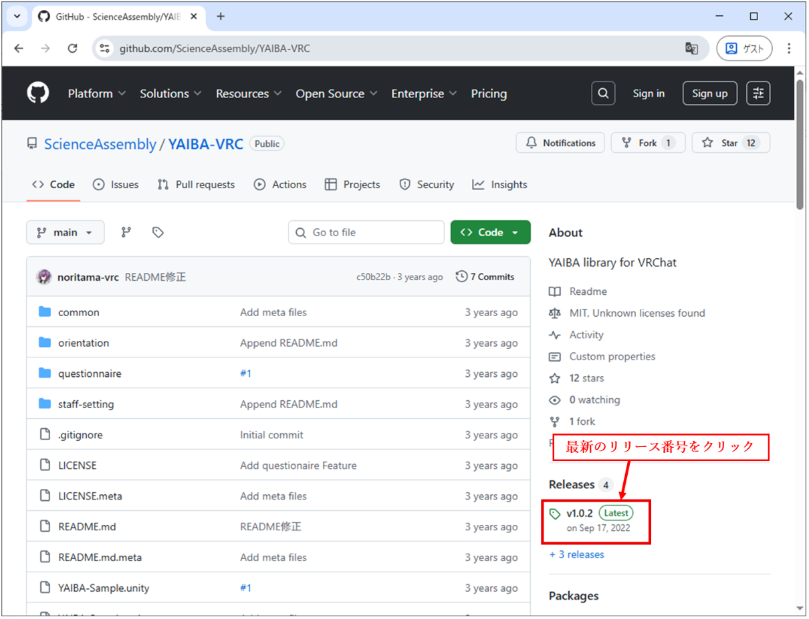
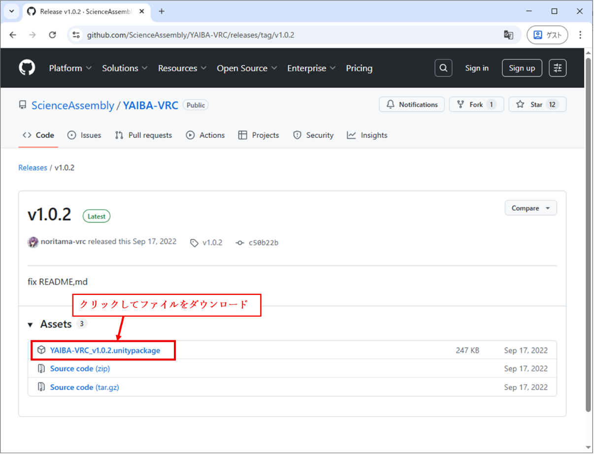
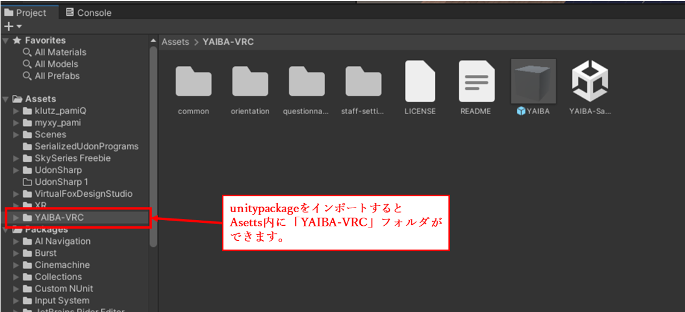
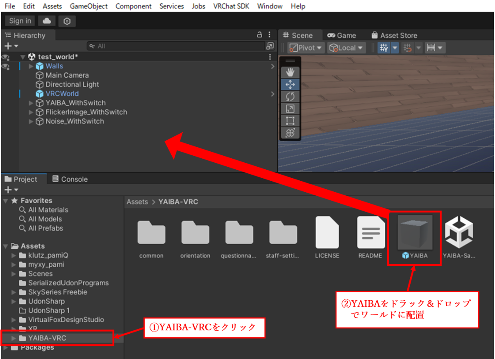
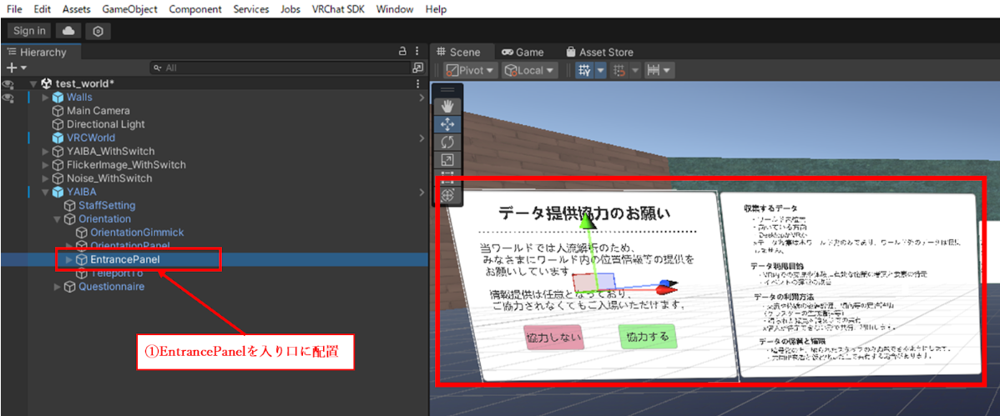
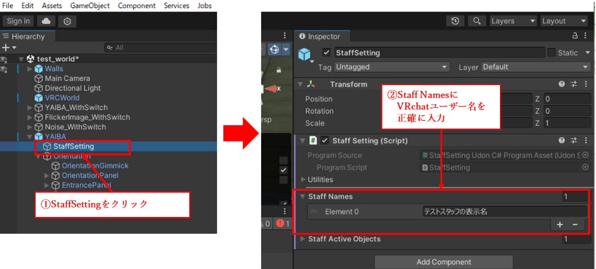
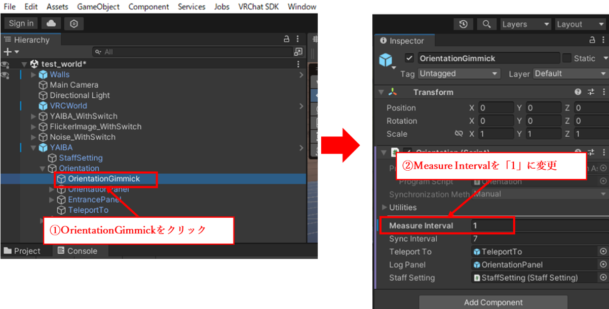
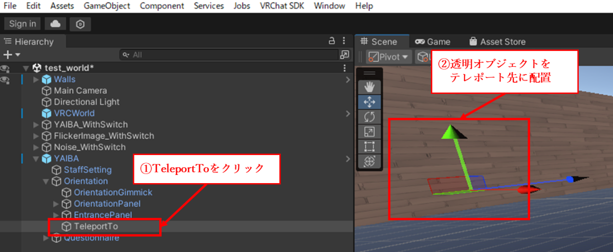
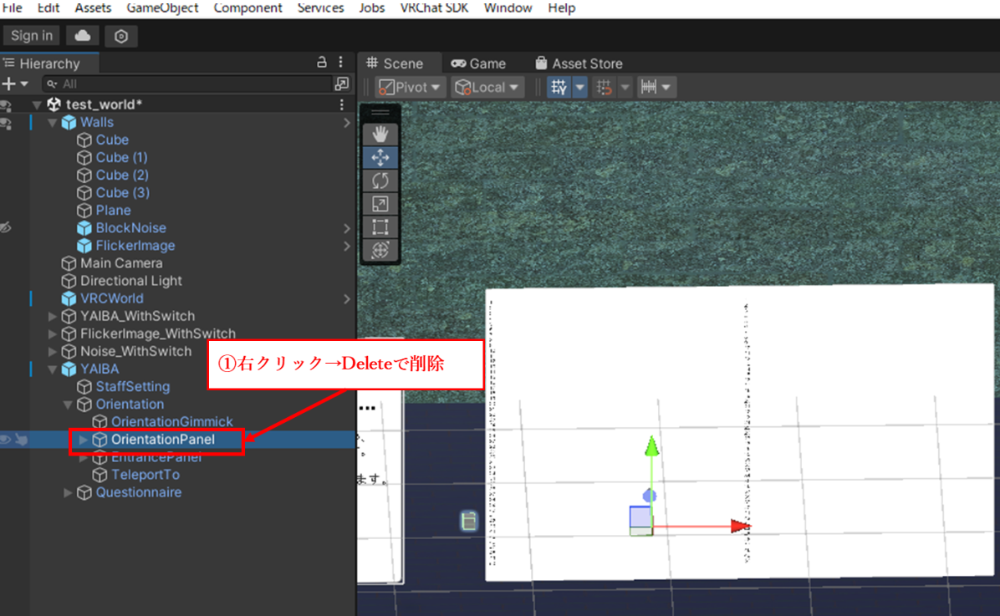
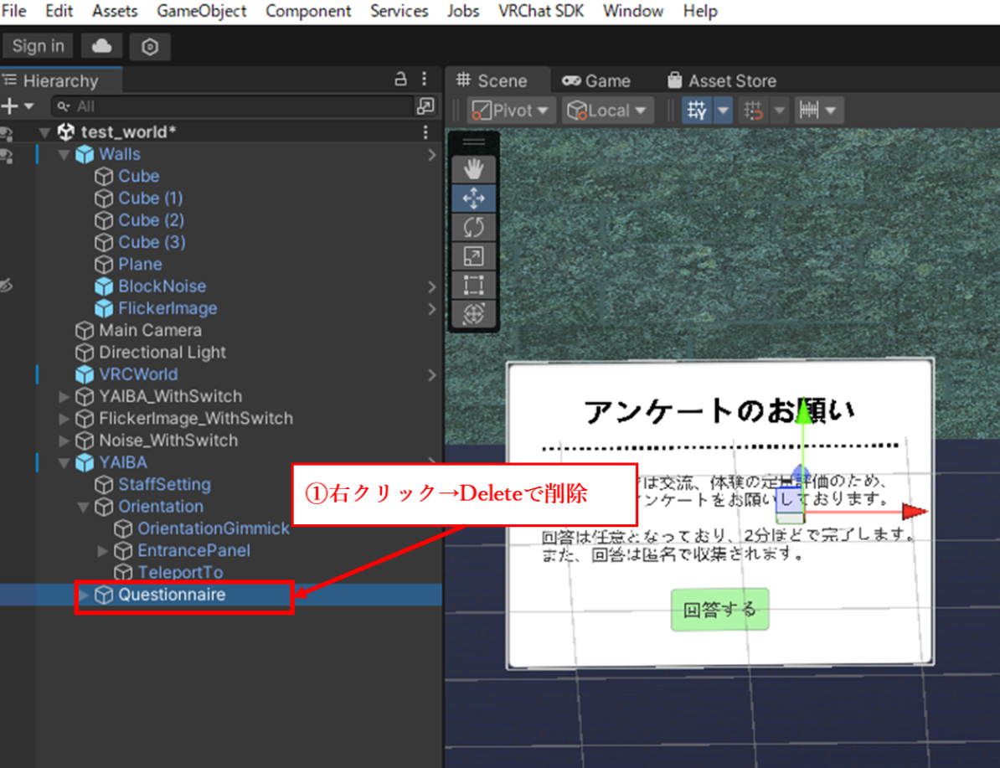

# YAIBA-VRC導入とデータ取得の方法

# １．はじめに

　YAIBA（[https://note.com/cocu\_tan/n/n70972d7646bd](https://note.com/cocu_tan/n/n70972d7646bd)）とはVRChatでのユーザーの位置情報やアンケート収集をおこなうシステムであり、データを収集するためにワールド作成時に設置するYAIBA-VRC（[https://github.com/ScienceAssembly/YAIBA-VRC](https://github.com/ScienceAssembly/YAIBA-VRC)）と、そこから得られたデータを自身で分析しやすいCSV形式やJSON  
形式にデータを変換（＋分析例を示す）YAIBA（[https://github.com/ScienceAssembly/YAIBA](https://github.com/ScienceAssembly/YAIBA)）で構成されている。本資料ではYAIBA-VRCを導入し、YAIBAなど分析に向けて次のプロセスにつなげるためのデータを取得する方法について説明する。

### 注意

YAIBAによるデータ収集は、事前登録したユーザーのVRChatログデータに各種情報を記録するツールです。事前登録したユーザーがいるインスタンス内かつそのユーザーが滞在している時間の情報のみを取得することができます。事前登録したユーザーが滞在していないインスタンスの情報は取得することができません。

# ２．YAIBA-VRCの導入

## ２．１　YAIBA-VRCのunitypackageファイルを入手

　   
　YAIBA-VRC（[https://github.com/ScienceAssembly/YAIBA-VRC](https://github.com/ScienceAssembly/YAIBA-VRC)）のページにアクセスし、下の画像に記載している手順でunitiypackageを入手する。

1) 画面右下の「**最新のリリース番号(Latest)**」をクリックします。

  

2) 「**YAIBA-VRC\_(バージョン番号).unitypackage**」を**クリック**し、unitypackageを  
   ダウンロードします。

  

## ２．２　YAIBAを設置したいワールドをUnity上に用意する

　ワールドの作成方法については各自調べて対応してください。試しに見てみたい場合はYAIBA-VRCにYAIBA-Sampleとしてサンプルが用意されているので、それを使用して確認してください。

## ２．３　YAIBA-VRCのunitypackageを読み込む

　上記のワールドを用意したプロジェクト上でYAIBA-VRCのunitypackage（ YAIBA-VRC\_v1.0.2.unitypackage）を読み込んでください。問題なく読み込みが完了できていれば、下の画像のようにunityの左下のウインドウに「YAIBA-VRC」が追加されます。

  

## ２．４　YAIBA-VRCを配置する

1) YAIBA-VRC内にある”YAIBA”を自身のワールドに配置してください。  
* 「YAIBA-VRC」フォルダをクリックし、「YAIBA」を自身のワールド内に  
  ドラック＆ドロップで配置します。

  

## ２．５　YAIBA Prefabの最低限の設定手順

1. スポーン地点の前に「データ提供のお願い」確認画面を配置してください。  
   「YAIBA\\Orientation\\EntrancePanel」を配置します。

  

2. 「YAIBA/StaffSetting」の「Staff Names」には、**ログ取得を許可するスタッフの**  
   **「VRChatのユーザー名」を正確に入力**します。複数名を設定することも可能です。  
   ※ ここで設定されたユーザーだけが、YAIBA-VRCによって位置や回転、アンケート結果などのデータを記録できます。  
   通常の参加者全員を登録する必要はありません。解析担当など、必要な人のみを設定してください。  
   **※VRChatのユーザー名を間違えるとログが取得できません。注意して設定してください。**

  

3. YAIBA/Orientation/OrientationGimmickのMeasure Interval（データ取得間隔）を設定する＜**推奨設定：1（秒）**＞  
   ※位置情報を取得する周期です。あまり長い秒数だと正しく分析できなくなります。

  

4. 「データ提供のお願い」確認の**同意後に移動する場所**にYAIBA/Orientation/TeleportToを配置する（テレポートが不要であれば無効化する）  
   ※「協力する」「協力しない」どちらを押しても配置先にテレポートします。  

  

     
5. 「アンケートのお願い※」などのパネルの位置や内容を適宜設定する。

※ **適切なアンケート実施には専門知識が必要です。**多くの場合、有効活用できないだけではなく、**回答者へ不要なストレスを与えます**。明確な意図がない限りは**アンケート機能は無効化しておくことをおススメ**します。

1) 「YAIBA/Orientation/OrientationPanel」（ユーザーの位置情報の確認パネル）は特に使用しないため、不要な場合「右クリック→Delete」で削除します。

  

2) 「YAIBA/Questionnaire」もアンケート機能の為、不要の場合  
   「右クリック→Delete」で削除します。

  

6. ワールドをアップロードする
VRChatに通常と同じようにワールドをアップロードしなおしてください。
以上でYAIBA-VRCの設置は完了です。

### YAIBA Prefabの主なパラメータ

YAIBA/StaffSetting

* Staff Names：スタッフとして登録するプレイヤー名を設定  
* Staff Active Objects：スタッフのみに表示するオブジェクトを設定。**デフォルトの "DebugSwitch" は非アクティブにしないこと。**

YAIBA/Orientation/OrientationGimmick

* Measure Interval：位置・回転情報をVRChatログに記録する間隔  
* Teleport to：位置・回転ログ取得の同意確認後のテレポート先。同意後のテレポートが不要な場合は無効化。

YAIBA/Questionnaire/QuestionnaireGimmick

* Questions：質問文と選択肢を設定。**Questions のサイズは 11 以下である必要があります。**  
   各要素は、最初の段落に質問文、その後に選択肢（最大6個まで）。**各要素のサイズは7以下にする必要があります。**  
* Questions Fontsize：質問文と選択肢のフォントサイズ  
* Next Question：各選択肢に対応する次の質問番号。質問1は \[0\]、質問2は \[1\]…  
   質問番号が \[Size of Questions\] に設定されている場合、アンケート確認画面に遷移します。

# ３．データの取得

YAIBA-VRCを使用して取得した位置情報などのデータはVRChatのログデータに記録されています。ログデータの保存場所は、デフォルトの設定では  
C:\\Users\\ (Windowsのユーザ名)\\AppData\\LocalLow\\VRChat\\VRChat  
に"output\_log\_YYYY-MM-DD\_hh-mm-ss.txt"のようなファイル名で保存されています。このデータを使用します。
### **※ログファイルは1～2日で自動削除されます注意してください**

### 注意

ログファイルはVRChatをログアウトしたときに出力されます。  
**ログファイルは一時的なものでVRChatの仕様上あまり長く残されず自動で消されてしまいます。必要なログファイルは1日以内に保存場所を移動しておくことを強くおススメします。** 

# ４．収集されるデータ
  - プレイヤーの座標（x, y, z）
  - プレイヤーの回転（Pitch / Yaw / Roll）
  - ログ取得はプレイヤー本人の 同意後に開始
  - プレイヤーの入退室情報
  - PlayerID などの基本識別情報
  - アンケート（Questionnaire）結果
  - ヨドコロタグマーカー情報(※設置した場合)
